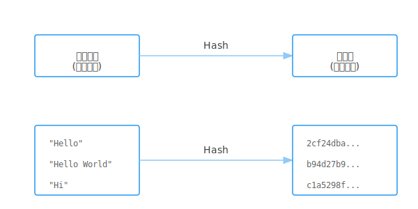
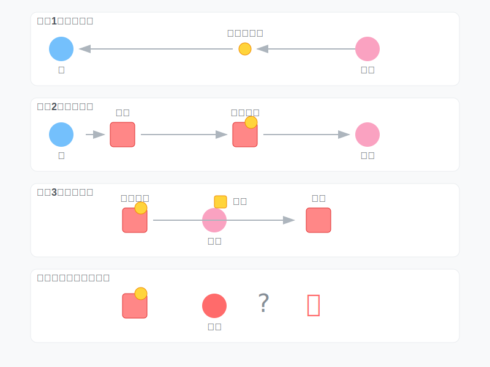
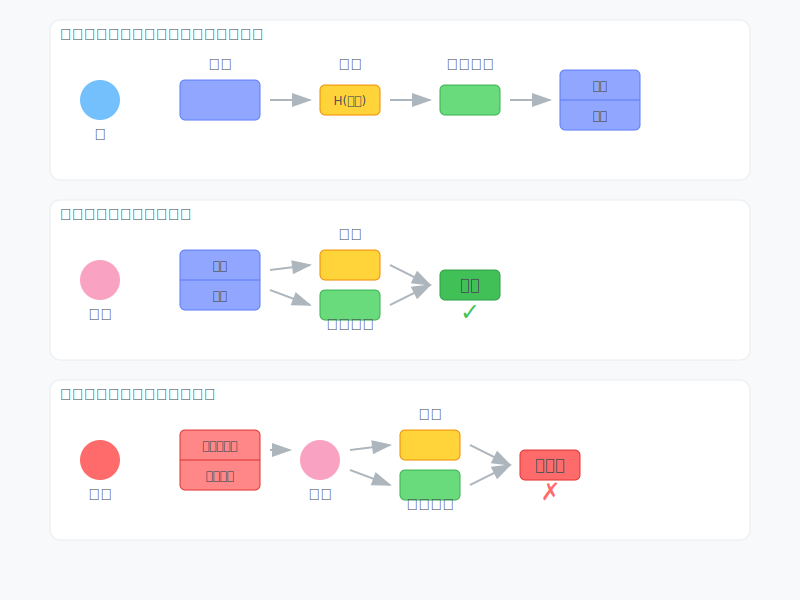

## 引子

你或许听说过比特币，自从这个东西诞生以来，江湖上就一直有它的传说。有人因为它一夜暴富，跨越阶级；有人因为它耗尽家财，负债累累；也有的人同时有这两段经历，大起大落。有的国家将它作为法定货币，有的地区将它视为违法犯罪，更多时候它作为一种灰色产业出现。但是无论你见与不见，它一直在那里。

所以让我们来了解一下区块链这个东西吧

### 区块链为何而生
有人认为比特币的诞生就是一个骗局，最终这些数据的价值都会归零。但其实，比特币给出了一个现实问题的解决方案，而这个问题今天仍会困扰我们。那就是当我们网上购物时，如何信任一个在网线另一端的陌生人？在比特币诞生以前，还有现在的大多数时候，我们选择依靠一个可信任的第三方来处理电子支付，比如银行、微信、支付宝。但是，有人有不同的想法。


2008年，一个网名为中本聪(Satoshi Nakamoto)的人发布了一篇论文：***"Bitcoin: A Peer-to-Peer Electronic Cash System"*** ，在这里第一次提出了区块链这个概念。他提出，要建立一个"基于密码学原理而不是信任的电子支付系统"。

后面，我将通过几篇文章，向你一步步展示一个区块链是怎么运作的。

### 密码学
要想理解区块链，你最好有一些密码学知识。


生活中密码一词往往被视为登录网页的密码，事实上这个"密码"或许被叫做口令更为合适。今天我们这里讨论的密码指的是Cryptography，最初代表的意思是信息保密地保存和传输。

你可能听说过凯撒加密，凯撒在传递命令之前，将书信中的每一个字母替换成字母表中后几位的字母，比如文章中的a全部换成c，b换成d，而到了结尾将y换为a，z换成b。这样敌人截获了书信也不知道命令具体是什么。这就是最早的密码学。

这里我们简单介绍一些区块链中使用到两个最重要的密码学算法，哈希算法和非对称加密。

### 哈希算法(Hash)
你可能知道哈希表，那便是哈希算法的一个应用。哈希算法将一个任意长度的输入转化为一个固定长度的输出。显然这是一种不可逆的运算，我们不能通过哈希值还原出输入。


一个简单的Hash:

```python
def simple_hash(x):
    return x % 1024
```

这个函数将输入对1024取模，使得一个输入转化为了一个10位的输出。显然，对1024同模的数会产生同样的哈希值，这就是哈希碰撞

在区块链中，哈希算法作为一个数据摘要的实现，我们希望使用的哈希函数具有抗碰撞性，即没有一个高效的方法制造哈希碰撞。任何方法都和从0开始遍历的效率一样，这便实现了工作量证明。

我们可以使用python中的hashlib来调用一些哈希函数，比如说比特币使用的SHA-256

```python
import hashlib

data = "hello blockchain"

data_digest = hashlib.sha256()
data_digest.update(data.encode())

print(data_digest.hexdigest())

```

这会输出data="hello blockchain"的哈希值"`cf55026ba78c889dbdaf0c32701cdb4d662f3d3ea4460110d3ed2edd0d753e72`

如果我们把data改为"hello blockchain!"的话，我们发现输出的哈希值变成了"`108be1bede687534d56a8229d4deabccfd9ee83358b15e3e95286915b8a4f648`"
我们只是增加了一个符号，哈希值便发生了巨大的改变

### 非对称加密

首先我们说说对称加密，这是指加密和解密的密钥相同的加密算法。比如说你和你的同桌上课传纸条，你们约定把每个字母向后偏移1个位置来加密，也就是说a->b,d->e,z->a，那么1就是加密和解密的密钥，这便是对称加密。

非对称加密是一种使用一对密钥的加密方式——公钥和私钥。公钥可以公开分享,而私钥需要保密。使用公钥加密的信息只能用对应的私钥解密,反之亦然。

比如说，你想通过你女神的闺蜜给女神送礼物，但是你不想让中间人知道你送的时什么，于是你从女朋友那里拿了一个锁 ( 公钥 ) ，用这把锁把礼物锁起来再送出去。女朋友拿到时，使用自己的钥匙 ( 私钥 ) 打开锁，就安全拿到了礼物。这便是非对称加密。



除了用来加密传递消息，非对称加密还可以用来电子签名。

你现在写了一篇情书想让女神的闺蜜送给她。你可以通过使用女神的公钥加密使得闺蜜无法偷窥到你的小秘密。但是如果闺蜜觉得你不够信任她，于是把你的情书进行了篡改(虽然她也不知道篡改后会变成什么样子，但是满足了她的破坏欲)。或者更坏，她写了一篇小作文以你的名义给了女神。这样你的好事彻底泡汤了。

那么，我们便需要使用数字签名。在发出消息之前，我们将消息进行哈希，然后将哈希值使用我们的私钥进行加密。将消息和这个被加密的哈希值一起发给女神。女神收到消息后，将自己计算一次消息的哈希，然后使用你的公钥对传来的加密过的哈希进行解密，如果两个哈希一致，那么说明这真是你写的情书，而且内容没有被闺蜜修改。

