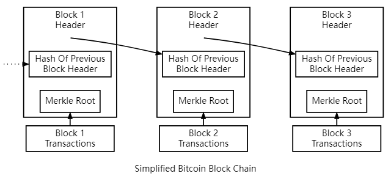

## 一个最简单的区块链

### 区块链的构成
我们先看一下区块链长什么样，下面是一个简化的比特币区块链示意图(图片来自 bitcoin.org)



首先，区块链由一个个区块(block)构成，图片中的区块从左到右按顺序产生，右边为最新的区块。

区块分为区块头和区块体，区块头中储存了前一个区块的hash值，一个Merkle树(默克尔树)的根，区块体中储存了这个区块中的交易信息。

关于默克尔树和交易信息我们先暂且不表，下面我们简单实现一个只包含一个字符串数据的区块链


1. 下面是区块类，由索引，时间戳，数据，前一个区块的哈希组成，创建时计算区块的哈希值储存下来
```py
class Block:
    def __init__(self, index, data, previous_hash):
        self.index = index
        self.timestamp = time.time()  # 当前时间戳
        self.data = data
        self.previous_hash = previous_hash
        self.hash = self.calculate_hash()

    def calculate_hash(self):
        # 计算区块的hash值
        # 这里我们使用sha256算法
        sha = hashlib.sha256()
        sha.update(
            str(self.index).encode("utf-8")
            + str(self.timestamp).encode("utf-8")
            + str(self.data).encode("utf-8")
            + str(self.previous_hash).encode("utf-8")
        )
        return sha.hexdigest()

    def __str__(self):
        return f"Block(index={self.index},\n timestamp={self.timestamp},\n data={self.data},\n previous_hash={self.previous_hash},\n hash={self.hash})"
```

我们在这里选择SHA256作为哈希算法，它有以下特性：

1. **安全性强**：SHA256是目前最安全的哈希算法之一，至今没有发现有效的碰撞攻击方法。这意味着：
   - 很难找到两个不同的输入产生相同的哈希值
   - 即使修改输入中的一个比特，输出的哈希值也会发生显著变化

2. **输出固定长度**：无论输入数据多大，SHA256始终产生256位（32字节）的输出，这个长度：
   - 足够长，可以有效防止碰撞
   - 又不会过长，便于存储和传输


2. 下面是区块链类，使用一个列表储存所以区块，同时记录区块高度，开始时创建一个区块(一般被称为创世区块)，可以通过`add_block`方法添加一个区块。我们还设置了一个`is_chain_valid`方法，通过遍历区块链检查哈希值是否算错以及储存的前一个区块哈希值是否正常，来判断区块链是否合法。

```py
class BlockChain:
    def __init__(self):
        self.chain = [self.create_genesis_block()]
        self.height = 1

    def create_genesis_block(self):
        return Block(0, "Genesis Block", "0")

    def get_latest_block(self):
        return self.chain[-1]

    def add_block(self, data):
        previous_block = self.get_latest_block()
        new_block = Block(self.height, data, previous_block.hash)
        self.chain.append(new_block)
        self.height += 1

    def is_chain_valid(self):
        for i in range(1, len(self.chain)):
            current_block = self.chain[i]
            previous_block = self.chain[i - 1]
            if current_block.hash != current_block.calculate_hash():
                return (
                    False,
                    f"The hash of the {current_block.index} block is not equal to the calculated hash",
                )
            if current_block.previous_hash != previous_block.hash:
                return (
                    False,
                    f"The previous hash of the {current_block.index} block is not equal to the hash of the {previous_block.index} block",
                )
        return True

```

3. 下面我们测试一下我们的mini区块链能否运行
```py
if __name__ == "__main__":
    blockchain = BlockChain()
    time.sleep(1)
    blockchain.add_block("First Block")
    time.sleep(1)
    blockchain.add_block("Second Block")
    time.sleep(1)
    blockchain.add_block("Third Block")
    print("blockchain height: "+str(blockchain.height))
    print("-"*100)
    print(blockchain.chain[0])
    print("-"*100)
    print(blockchain.chain[1])
    print("-"*100)
    print(blockchain.chain[2])
    print("-"*100)
    print(blockchain.chain[3])
```

测试程序创建了一个区块链，然后添加了三个区块，然后打印相关信息，输出如下。我们可以看到每一个区块储存的 previous_hash 和前一个区块的hash值相同。

```
blockchain height: 4
----------------------------------------------------------------------------------------------------
Block(index=0,
 timestamp=1731656026.8961995,
 data=Genesis Block,
 previous_hash=0,
 hash=528b8cb76d09cc178ef8cdcbbbc1b5ff45ecb2639edecdb786e9b850742eb79d)
----------------------------------------------------------------------------------------------------
Block(index=1,
 timestamp=1731656027.8971088,
 data=First Block,
 previous_hash=528b8cb76d09cc178ef8cdcbbbc1b5ff45ecb2639edecdb786e9b850742eb79d,
 hash=17a5ece381d2d4439ca20c7531ad3f372b8d22435495e47b728ea2e50284558c)
----------------------------------------------------------------------------------------------------
Block(index=2,
 timestamp=1731656028.8973522,
 data=Second Block,
 previous_hash=17a5ece381d2d4439ca20c7531ad3f372b8d22435495e47b728ea2e50284558c,
 hash=f808c10d4e843a38d39d51fa5e1a2842e738576475202b795ef2254da7772e68)
----------------------------------------------------------------------------------------------------
Block(index=3,
 timestamp=1731656029.897595,
 data=Third Block,
 previous_hash=f808c10d4e843a38d39d51fa5e1a2842e738576475202b795ef2254da7772e68,
 hash=79038d89726b2777536c7251f6f3c5735eef84e170610aeff8dad7836b4e96aa)
```

如果我们试图对区块链进行篡改，把第二个区块的数据换为"Changed Block"，我们检查区块链合法性就会发现区块链被篡改了。
这是因为区块二虽然接上了区块一，但是区块三中仍然储存了未篡改的区块二的哈希值，这样检查时会发现区块二被修改了

那么我们应该如何篡改一个区块链而不被发现呢？目前我们可以想到两种方法：

1. 我们在修改区块二后将区块三的previous_hash也同时修改，这样区块三就不会发现区块二被篡改了。但是，在计算区块的哈希时我们将previous_hash也纳入了计算，所以区块三的哈希值就会变化。这样我们必须将区块二后的全部区块进行修改才可以不被发现
2. 我们在修改区块二时，想办法使得篡改的区块二哈希值和之前一样，那样区块三就不会发现任何异常。实际上，这就是在尝试实现一次哈希碰撞，而我们目前还没有已知的有效方法可以对SHA256进行哈希碰撞攻击，SHA256仍然是一个安全的哈希算法

```py
if __name__ == "__main__":
    blockchain = BlockChain()
    time.sleep(1)
    blockchain.add_block("First Block")
    time.sleep(1)
    blockchain.add_block("Second Block")
    time.sleep(1)
    blockchain.add_block("Third Block")
    blockchain.chain[2] = Block(2, "Changed Block", blockchain.chain[1].hash)
    print(blockchain.is_chain_valid())

输出
(False, 'The previous hash of the 3 block is not equal to the hash of the 2 block')
```

我们这里实现了一个迷你的区块链，但是一个区块只能储存一条数据。下一节我们将会使用Merkle树将多条数据储存到区块中。