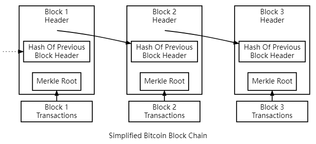

## Merkle树

上篇文章中我们展示的简化区块链中，每个区块中储存了一个Merkle Root，这是这个区块下Merkle树的根。这一节我们将从这个Merkle Tree开始讲起。


### 什么是Merkle树
Merkle Tree(默克尔树)也叫哈希树，它是一个树形结构,树的叶子节点是数据块的哈希值,非叶子节点是其对应子节点串联字符串的哈希值。

下面是一个简单的Merkle树结构，我们有A,B,C三个数据，分别计算哈希值作为叶子节点，然后两两配对，计算哈希值之和的哈希值，作为两个节点的父节点，父节点继续两两配对直到根节点。

我们注意到，我们如果在某一层只有奇数个节点时就无法两两配对(比如下图中就只有三个叶子节点)。我们选择将没有配对的节点与它的副本进行哈希处理。


### 为什么用Merkle Tree

在比特币中,每个区块都包含了一个Merkle树,树的叶子节点是这个区块中所有交易的哈希值。这样做有以下好处:

1. **防止篡改**：如果有人修改了Merkle树中的某个数据，那么其哈希值会发生变化，导致Merkle Root发生改变。而区块头中包含了Merkle Root，所以该区块的哈希值也会变化从而被检测。

2. **提供简化验证**：我们的区块链网络中存在不保存整个区块而只保存区块头的**轻节点**(对应的，储存了所有数据的节点叫**全节点**)，通过Merkle树，我们可以向轻节点提供简化的验证服务(我们下一节细说)

### 实现一个简单的Merkle Tree

1. 我们首先定义一个默克尔树节点类
如果输入左右孩子，则为中间节点，计算左右孩子哈希之和的哈希
如果输入data，则为叶子节点，计算data的哈希值

```py
class MerkleNode:
    def __init__(self, left=None, right=None, data=None):
        self.left = left
        self.right = right
        self.data = data
        self.hash = self.calculate_hash()

    def calculate_hash(self):
        if self.data is not None:
            sha = hashlib.sha256()
            sha.update(str(self.data).encode("utf-8"))
            return sha.hexdigest()
        else:
            sha = hashlib.sha256()
            sha.update(str(self.left.hash).encode("utf-8") + str(self.right.hash).encode("utf-8"))
            return sha.hexdigest()
```

2. 然后构建Merkle Tree类：
输入一个data列表，首先生成叶子节点，然后构建Merkle树
我们着重看一下`build_tree(self, nodes)`这个方法。对于输入的节点列表，我们遍历该列表，两两配对生成新的节点，如果没有配对的使用自己的副本配对。一个循环结束后，如果只剩一个节点则就是根节点，如果节点数大于1还需要继续循环两两配对。

```py

class MerkleTree:
    def __init__(self, data):
        self.leaves = [MerkleNode(data=d) for d in data]
        self.root = self.build_tree(self.leaves)

    def __str__(self):
        def print_node(node, level=0):
            if not node:
                return []
            result = [" " * (level * 4) + f"Hash: {node.hash}"]
            if node.data is not None:
                result.append(" " * (level * 4) + f"Data: {node.data}")
            if node.left:
                result.extend(print_node(node.left, level + 1))
            if node.right:
                result.extend(print_node(node.right, level + 1))
            return result
            
        return "\n".join(print_node(self.root))

    def get_root_hash(self):
        return self.root.hash

    def build_tree(self, nodes):
        while len(nodes) > 1:
            temp_nodes = []
            for i in range(0, len(nodes), 2):
                left = nodes[i]
                right = nodes[i + 1] if i + 1 < len(nodes) else nodes[i]
                parent = MerkleNode(left=left, right=right)
                temp_nodes.append(parent)
            nodes = temp_nodes
        return nodes[0] if nodes else None 
```

3. 我们测试一下这个Merkle树代码

```py
if __name__ == "__main__":
    data = ["a", "b", "c","d","e","f",]
    tree = MerkleTree(data)
    print(tree)
    tree.save_svg()
```

输出如下，可以见到和我们前面例子中的Merkle树结构类似。e,f的父节点没有配对对象，于是产生了一个副本进行配对
```
Hash: 5269ef76f0df413ef337130ed716dd53e73e92905b25a533210e9142edfda01b
    Hash: 58c89d709329eb37285837b042ab6ff72c7c8f74de0446b091b6a0131c102cfd
        Hash: 62af5c3cb8da3e4f25061e829ebeea5c7513c54949115b1acc225930a90154da
            Hash: ca978112ca1bbdcafac231b39a23dc4da786eff8147c4e72b9807785afee48bb
            Data: a
            Hash: 3e23e8160039594a33894f6564e1b1348bbd7a0088d42c4acb73eeaed59c009d
            Data: b
        Hash: d3a0f1c792ccf7f1708d5422696263e35755a86917ea76ef9242bd4a8cf4891a
            Hash: 2e7d2c03a9507ae265ecf5b5356885a53393a2029d241394997265a1a25aefc6
            Data: c
            Hash: 18ac3e7343f016890c510e93f935261169d9e3f565436429830faf0934f4f8e4
            Data: d
    Hash: 38e21934b1ddf3c5f90417378522702c447f4ab79ca6d62843e071b775948035
        Hash: 1b3dae70b4b0a8fd252a7879ec67283c0176729bfebc51364fb9e9fb0598ba9e
            Hash: 3f79bb7b435b05321651daefd374cdc681dc06faa65e374e38337b88ca046dea
            Data: e
            Hash: 252f10c83610ebca1a059c0bae8255eba2f95be4d1d7bcfa89d7248a82d9f111
            Data: f
        Hash: 1b3dae70b4b0a8fd252a7879ec67283c0176729bfebc51364fb9e9fb0598ba9e
            Hash: 3f79bb7b435b05321651daefd374cdc681dc06faa65e374e38337b88ca046dea
            Data: e
            Hash: 252f10c83610ebca1a059c0bae8255eba2f95be4d1d7bcfa89d7248a82d9f111
            Data: f
```

`save_svg()`方法将这个树转化为svg图片，代码有些长就不放到文章里了，可以在github上获取文章相关代码

这个树的输出图片如下


### 修改我们的区块链
我们已经实现了一个Merkle Tree，下面让我们把它应用到我们的区块链上

1. 首先修改我们的`Block`类，用merkle树替代输入的data
```py
class Block:
    def __init__(self, index, merkle_tree: MerkleTree, previous_hash):
        self.index = index
        self.timestamp = time.time()  # 当前时间戳
        self.merkle_tree = merkle_tree
        self.merkle_root = merkle_tree.get_root_hash()
        self.previous_hash = previous_hash
        self.hash = self.calculate_hash()


    def calculate_hash(self):
        # 计算区块的hash值
        # 这里我们使用sha256算法
        sha = hashlib.sha256()
        sha.update(
            str(self.index).encode("utf-8")
            + str(self.timestamp).encode("utf-8")
            + str(self.merkle_root).encode("utf-8")
            + str(self.previous_hash).encode("utf-8")
        )
        return sha.hexdigest()
```

> 为什么计算哈希值时不把整个merkle树放进去？
我们在`calculate_hash`函数中没有把整个树结构放进去，这是因为merkle_root已经有了整个树的信息摘要，如果树发生了变化那么它的根也会变化，所以没必要将整个树计算哈希增加工作量

2. 对于`BlockChain`类，只需要修改对应输入的数据格式即可适应这个改变

```py

class BlockChain:
    def __init__(self):
        self.chain = [self.create_genesis_block()]
        self.height = 1

    def create_genesis_block(self):
        return Block(0, MerkleTree(["Genesis Block"]), "0")

    def get_latest_block(self):
        return self.chain[-1]

    def add_block(self, data: list):
        previous_block = self.get_latest_block()
        new_block = Block(self.height, MerkleTree(data), previous_block.hash)
        self.chain.append(new_block)
        self.height += 1
```

3. 下面我们测试一下这个使用了Merkle树的区块链，最后使用的`save_svg`将该区块链可视化为svg图片，代码太长不在文章中展示。

```py
if __name__ == "__main__":
    blockchain = BlockChain()
    time.sleep(1)
    blockchain.add_block(["First Block","hello world","yes"])
    time.sleep(1)
    blockchain.add_block(["Second Block","BlockChain","I like money"])
    blockchain.save_svg("blockchain.svg")
```
输出图片如下


这一节我们聊了聊Merkle树，我们提到了轻节点和全节点，下一节我们将谈谈区块链中节点的分工合作。