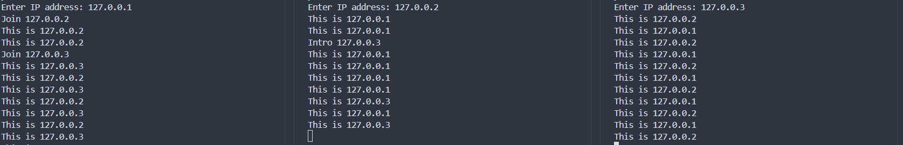

## 区块链中的节点 I

我们前面谈到的区块链仿佛都运行在同一个设备上，但实际上区块链是由许多节点组成的分布式系统。每个节点都是网络的参与者，节点之间通过P2P进行通信和同步。

区块链节点的功能有：储存数据，验证交易，参与共识，网络通信等
而根据功能和权限的不同，区块链节点也有很多分类，不过在这里我们简化为两类：全节点(Full Node)和轻节点(Simple Node)，全节点储存了整个区块，而轻节点只储存了每个区块的区块头

下面我们讨论一下节点的合作

### P2P网络
P2P(Peer to Peer)网络是区块链的基础架构,它允许节点之间直接进行通信,而不需要中心服务器。每个节点既是服务器也是客户端,可以向其他节点请求数据,也可以为其他节点提供数据。

在我们的区块链中，我们需要节点之间交换数据，将数据打包成区块然后组成一条有共识的区块链。所以节点之间需要有网络通讯,当一个新节点加入网络时,它需要:
1. 连接到已知节点(种子节点)
2. 从这些节点获取其他节点的地址
3. 同步数据

> 什么是**种子节点**？

一个新节点想要加入这个区块链网络，首先需要和其他节点建立连接，同步当前的区块链。那么这第一步便产生了问题，要到哪里去找其他节点？
于是，我们在这个网络中设置了一类叫做种子节点的节点，它们的地址被硬编码在节点代码里。当新节点起步时会首先连接这些种子节点，然后从它们那里获取其他节点的地址

> 如何更新节点状态？

如果网络运行中一个节点离线了，或者新加入了一个节点，如何在其他节点中更新其状态呢？
我们可以使用心跳机制，让节点每隔一段时间向所有节点发送一条简短的信息(心跳)。如果接收到新节点的心跳就将其添加到节点列表中，如果一段时间后没有接收到某节点的心跳就视作该节点已经故障或离线

下面我们实现一个可以进行p2p通信的简单节点网络。

我们先思考一下我们p2p网络的结构应该怎么设计：(这只是一个简单的示例，现实中的实现不一定是这样的)
1. 节点建立时，向硬编码的种子节点发出加入网络的请求。种子节点将新节点加入列表，同时向所有节点介绍这个新节点
2. 节点收到一个介绍信息后，将其加入节点列表中，同时向该节点发送hello消息
3. 新节点接收到hello消息后，将发送方加入自己的节点列表中，这样便实现了节点列表的更新
4. 每隔一段时间节点会广播hello消息，接收到hello消息后节点要储存当前时间，如果长时间未接收到某节点的hello消息则在节点列表中删除

下面是形而下的实现

1. 我们首先建立节点类，初始化节点地址。其中，`peers`储存已知网络中的节点地址，初始化填入了种子节点；`hello_dict`储存上一次接收到其他节点hello消息的时间。使用`send_join`向种子节点发出加入网络的请求

```py
class Node:
    def __init__(self, ip):
        self.address = ip
        self.peers = {"127.0.0.1"}  # 种子节点
        self.socket = socket.socket(socket.AF_INET, socket.SOCK_STREAM)
        self.socket.bind((ip, 5000))    # 监听5000端口
        self.socket.listen(5)
        self.hello_dict = {}
        while True:
            try:
                self.send_join()    # 发送加入消息
                break
            except:
                time.sleep(1)
        self.handle_thread = threading.Thread(target=self.handle_connection)    # 处理连接
        self.handle_thread.start()
        self.helloloop_thread = threading.Thread(target=self.helloloop)    # hello消息检测
        self.helloloop_thread.start()
        self.mainloop_thread = threading.Thread(target=self.mainloop)    # 主循环
        self.mainloop_thread.start()
```

2. 然后我们定义一系列消息传递方法，定义了一系列的通信方式。

```py
    def send_msg(self, msg):
        for peer in self.peers:
            if peer == self.address:
                continue
            with socket.socket(socket.AF_INET, socket.SOCK_STREAM) as s:
                try:
                    s.connect((peer, 5000))
                    s.sendall(msg.encode("utf-8"))
                except:
                    print(f"Failed to send message to {peer}")

    def send_data(self, data):
        self.send_msg(f"@DATA{data}")

    def send_hello(self):
        self.send_msg(f"@HELLO{self.address}")

    def send_join(self):
        self.send_msg(f"@JOIN{self.address}")

    def send_intro(self,addr):
        self.send_msg(f"#INTRO{addr}")
```

3. 下面定义`handle_connection`方法接收消息并处理，`mainloop`执行一系列任务，`helloloop`处理hello信息
```py
    def handle_connection(self):
        while True:
            conn, addr = self.socket.accept()
            data = conn.recv(1024).decode("utf-8")
            if data.startswith("@DATA"):
                print(data[5:])
            elif data.startswith("@HELLO"):
                formaddr = data[6:]
                self.peers.update([formaddr])
                self.hello_dict[formaddr] = time.time()
            elif data.startswith("@JOIN"):
                formaddr = data[5:]
                self.send_intro(formaddr)
                self.peers.update([formaddr])
                print(f"Join {formaddr}")
            elif data.startswith("#INTRO"):
                formaddr = data[6:]
                self.peers.update([formaddr])
                print(f"Intro {formaddr}")   
            conn.close()

    def mainloop(self):
        while True:
            self.send_data(f"This is {self.address}")
            time.sleep(1)

    def helloloop(self):
        while True:
            self.send_hello()
            for peer in self.hello_dict:
                if time.time() - self.hello_dict[peer] > 10:
                    self.peers.discard(peer)
            time.sleep(5)
```

4. 我们进行简单的测试:
```py
if __name__ == "__main__":
    ip = input("Enter IP address: ")
    node = Node(ip)
```


开启3个终端建立3个节点，节点之间可以相互通信。


> 种子节点这么重要，会不会产生中心化？

有人或许会说，每个节点刚开始时都要首先和种子节点打交道，这会不会违背了去中心化的初衷。实际上我们可以发现，当新节点接入网络后，种子节点和其他节点并没有区别，如果种子节点离线了也不会对现在的网络造成影响。而接入网络时，我们可以设置多个种子节点来增加稳定性。甚至我们可以选择添加熟人节点来启动新节点，也就是通过其他途径，获取接入网络的某些节点地址，用它们来替代种子节点。
在实际运行的区块链中，这个网络会更加复杂，节点的类型也不止这些。

这一节我们建立了多个节点，并且把这些节点接入了一个p2p网络，下面我们将聊聊怎么让这些节点合作维护一个区块链
