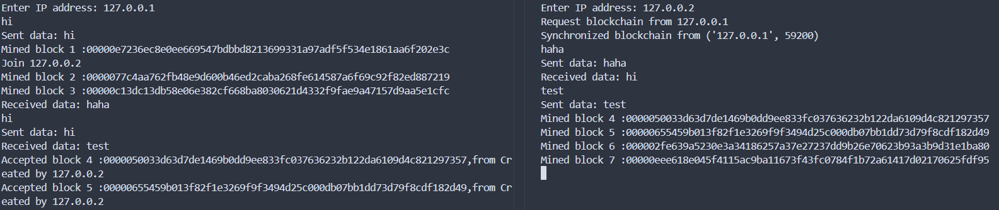

## 工作量证明

前面我们搭建了一个能够相互传输数据的p2p网络，现在我们希望使用这个网络维护一个区块链。我们现在应该让每个节点产生数据(比特币中的交易)后，发送给其他节点，然后一群数据打包为一个区块，将这个区块发送到网络中让大家都接受它，最后所有节点都将这个区块放入本地的区块链。

但是，由谁来打包这个区块呢？为什么要接收节点A发送的区块而不是B的呢？这有很多种共识算法，我们下面介绍一下工作量证明(Proof Of Work)，有时候人们也叫这个过程挖矿。

### 工作量证明(POW)

工作量证明的核心思想是通过计算一个复杂的数学问题，来证明某节点在区块链网络中进行了足够的工作，从而获得记账权(打包区块发给其他节点的)。这样说还是有些抽象，我们看一下工作量证明的基本流程:

1. 计算一个难题：网络中的节点需要解决一个复杂的数学难题，这个难题一般没有什么优化的解法，必须投入一定的算力才能解决，但是一旦有了答案便可以简单地验证
2. 竞争记账权：每个节点都在竞争解决这个问题，第一个解决的节点获取记账权
3. 打包和广播：获取记账权的节点将区块打包，广播给其他节点
4. 验证区块：收到区块的节点验证这个难题的解，以及这个区块的有效性
5. 奖励：成功打包区块的节点会获得一定的奖励(挖矿奖励)

我们回顾一下我们的区块，每个区块会由SHA256算法生成一个256位的哈希值。我们的工作量证明算法选择在每个区块中加入一个随机数(nonce)共同计算哈希值，寻找一个nonce使得区块的哈希值前n位都是0(即哈希值小于某个数)。由于哈希算法由很强的随机性，求一个符合条件的nonce的任何算法都和从0开始遍历效率是一样的。所以这是一个依赖于算力解决的问题。

如果某个节点想要攻击某个区块，那么它必须重做这个工作量证明。而且改变了一个区块，后续的区块都需要改变，也就是说它需要产生一条新的分叉。在网络中节点选择承认最长的一条链，所以需要这条恶意分叉长度超过诚实分叉时攻击才成功。我们可以看到，工作量证明实际是一种基于算力投票的机制，最长的链代表了有最多的算力投入这条链。如果区块链中多数的算力被诚实节点掌握，那么诚实的链就会成为最长的一条链被承认。而如果某个组织的算力占据了链上算力51%以上，那么便产生安全风险(51%攻击)

下面我们在我们的区块链上实现pow:

1. 首先我们需要修改`block`类，在区块头中加上nonce
```py
class Block:
    def __init__(
        self, index, merkle_tree: MerkleTree, previous_hash, nonce, timestamp=None
    ):
        self.index = index
        self.timestamp = time.time() if timestamp is None else timestamp  # 当前时间戳
        self.merkle_tree = merkle_tree
        self.merkle_root = merkle_tree.get_root_hash()
        self.previous_hash = previous_hash
        self.nonce = nonce
        self.hash = self.calculate_hash()
```

2. 我们需要修改`blockchain`类，添加difficulty变量，也就是区块的哈希值前多少位需要为0。
需要注意的是，在这里我们将difficulty直接写定为5，但实际上比特币中这个值是可变的，比特币使用移动平均数法来确定每小时生成区块的平均数，如果区块生成太快就加大difficulty。这样可以适应算力的不断增长。
这里我们还做出了一个修改，在创建创世区块时将时间戳也固定下来，使得不同节点有一个相同的创世区块

```py
class BlockChain:
    def __init__(self):
        self.chain = [self.create_genesis_block()]
        self.height = 1
        self.difficulty = 5

    def create_genesis_block(self):
        return Block(0, MerkleTree(["Genesis Block"]), "0", 0, timestamp=0)
```

3. 最大的修改是节点类，下面是"挖矿"方法，我们开始挖这个区块时将所有数据打包到MerkleTree中，然后清空数据队列。我们将数据队列第一个数据初始化为节点自己的地址(对应比特币中第一笔交易是产生新的比特币转给创建者)。然后从0开始尝试nonce，如果挖矿成功，将这个区块接入本地区块链同时广播给其他节点。(这里的发送代码详见原代码文件，需要实现区块的序列化和反序列化)如果在成功之前便收到其他节点传来的有效区块，则结束这个循环，开始挖下一个区块。
```py
    def mine(self):
        with self.data_lock:
            merkle_tree = MerkleTree(self.data_queue)
            self.data_queue = [f"Created by {self.address}",]
        nonce = 0
        timestamp = time.time()
        while not self.getBlock:
            block = Block(self.blockchain.height, merkle_tree, self.blockchain.get_latest_block().hash, nonce, timestamp)
            if self.blockchain.is_block_valid(block):
                with self.blockchain_lock:
                    self.send_block(block)
                    self.blockchain.append_block(block)
                print(f"Mined block {block.index} :{block.hash}")
                break
            nonce += 1

    def mine_thread(self):
        while True:
            self.mine()
            with self.signal_lock:
                self.getBlock=False
```

4. 下面我们进行测试，通过终端输入信息广播给网络，然后画出前5个区块，查看效果如下，可以看到节点成功上传了数据并进行了挖矿



> 为什么节点要打包数据？

我们可以发现，在区块链里，如果我们的节点在Merkle树中只储存第一个数据(也就是挖矿奖励)，那么挖矿成功也可以将这个只有一个数据的区块加入区块链，那么为什么还要浪费带宽和算力来接收其他节点的数据呢？当然，如果所有节点都这样的话，那今天的比特币或许早就无法正常运作了。

这就要说到我们常说的gas费了，当你在web3钱包里转账时，你常常会发现你转账前后的金额有损失，这就是消费了gas费。当一个交易提交时，会向打包成功的节点支付一定比例的gas费作为激励，这样便使得节点愿意处理这些输入，毕竟有没有加这些数据对挖矿难度没有影响。

而我们常说比特币是"电子黄金"，因为它的总量是不变的。这是由于每个区块的挖矿奖励会随着时间递减，每隔一段时间比特币会进行一次"减半"，也就是挖矿奖励变成之前的一半，这样一直到挖矿奖励比最小不可分割单位(聪)还小时彻底没有新的比特币产生。之后的挖矿激励全部变成了支付的gas费。