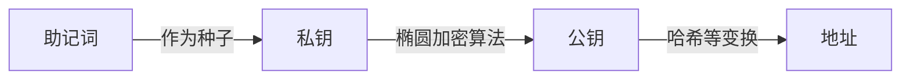
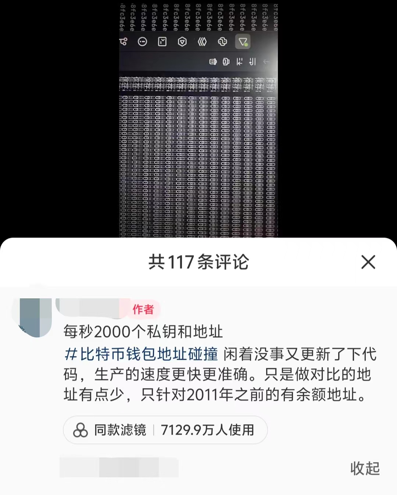

## Who am I ?

前面我们实现了一个p2p的区块链网络，节点之间将网络中的数据打包到一个区块中，然后通过工作量证明构建一个区块链。我们后面会逐渐将这些数据换成交易信息，将这个区块链改造成一个数字货币系统。

我们要实现交易，首先就要对每个节点进行识别。在现实生活中，我们有很多识别自己的方法，比如说身份证号，银行卡号，学校里的学号等等。但是在区块链上，我们应该如何识别每一个节点呢？你可能听说过web3钱包会有一个地址，那这个地址是什么呢？

---

### 区块链中的身份

我们现在整理一下我们的需求，我们希望有一个地址能够唯一标识自己，所有想给我们打钱的人只需要知道这个地址就可以打钱给我们。同时我们要能证明这个地址是我的，我们可以把这个地址上的钱给花出去。你可能想到了第0节时我们谈到的数字签名，我们可以将公钥公布出去，其他人将支付的数字货币标记上我们的公钥；在我们想要花这笔钱时，通过私钥来证明这笔钱属于我们。这样就让我们在区块链中有了自己的身份。

我们通过一个"钱包"，来实现这些功能，当我们进入web3世界时，我们都需要一个web3钱包。比较有名的web3钱包是metamask，它的图标是一只小狐狸，支持以太坊等许多区块链的钱包，你可以在你的手机或者chrome浏览器上下载使用。如果你用过类似的web3钱包，你可能发现它们和刚刚说的想法好像不一样，这主要是因为下面这两点:

1. **地址**
刚刚我们提到了使用公钥作为我们的标识，但实际中我们往往使用一个更短的数字来作为我们的钱包地址(钱包软件中那个0x开头的串)，这个地址是我们的公钥通过哈希和一些变换产生的。我们使用的哈希函数有抗碰撞性，所以该地址依旧可以唯一标识我们的钱包。
为什么要多此一举？首先，通过哈希等一系列变换，地址的长度比公钥会更短，这在使用的时候更方便；同时，生成地址时会使用校验位，避免用户将数字货币转账到一个错误的地址；并且，使用地址避免了公钥的暴露，增加了隐私保护。

**插一嘴:量子计算**

量子计算机时这些年比较火的概念，有人认为研究量子计算这群人是在炒概念骗经费，也有人认为量子计算机会是一个无所不能的存在。但不可否认，量子计算对很多加密技术有着很大的冲击。比特币中使用的椭圆曲线密码(ECC)基于椭圆曲线离散对数问题，而量子计算可以高效求解这个问题。也就是说借助量子计算，我们可以通过你的公钥去破解你的私钥。但是我们的实现中只暴露了一个地址，地址是公钥经过哈希产生的，所以这中间出现了信息的损失，我们是无法通过地址去恢复公钥信息的。这样从某些方面抵御了未来可能出现的风险。

总有人认为量子计算出现后基于密码学的区块链就会轰然崩塌，但实际上安全性是区块链设计时的一大考量，密码学界有人在积极研究“后量子加密”，或许在量子计算大规模应用之前，我们已经设计好了对抗量子计算的区块链。而传统的线上交易也依赖了很多加密技术，量子计算对这些传统交易的冲击或许会更大。说不准到时候，区块链才是线上交易的最优解。


2. **助记词**
我们回到钱包的实现上来。在使用metamask创建钱包时，你似乎并没有接触到公钥和私钥，而是钱包软件给了你12个(或者24个)英文单词，这些单词是助记词，软件会提醒你千万不要把这些单词告诉别人。这些单词是什么东西呢？
我们刚刚提到，使用公钥和私钥来构建一个钱包。我们需要随机选取一个私钥，然后依据私钥生成公钥，最后通过公钥产生地址。问题出在第一步：如何选取一个私钥？我们知道目前我们计算机上产生的随机数都是伪随机，是从一个**种子**开始通过伪随机算法生成了一系列看上去随机的数。也就是说如果我们知道了算法和种子，就可以重复生成这一随机数序列。这里的助记词就是起到了种子的作用。钱包程序首先随机产生一个助记词序列，通过这些助记词生成一个种子，再使用种子产生私钥。所以如果你的助记词泄露，那么你的私钥就被攻击者获取了。
通过使用助记词，我们一般的用户就不需要自己记录那些复杂的私钥和公钥，只需要记住几个英文单词就可以掌握自己的钱包。助记词的产生遵循一些标准，最常用的是BIP-39 标准，从2048 个单词 中选出12个或24个单词组成的有序单词序列作为助记词。

下面是建立一个钱包的流程图



### web3世界的"永动机"——私钥碰撞机

永动机作为一个反科学的研究方向，一直有人为之努力，有的人是为了忽悠客户，有的人是自己真的信了。但是不可否认的，在反驳各类永动机时我们的科学也有所进步。

现在，我们web3世界也有自己的永动机了！从比特币诞生以来，一直有人问这么一个问题:私钥/助记词就那么几位，我多试试是不是就能试出个有着巨款的钱包？这就是下面图片里展示的私钥/助记词碰撞。




这钱赚的真这么容易吗？真的像他们说的靠多开和时间就能出货吗？让我们简单算笔账:

按照前面提到的BIP-39 标准，我们从2048个单词中选12个单词作为助记词，那么一共有 $2048^{12}=2^{132}$ 个可能的地址(实际中可能有其他约束，但数量级是一致的)。而目前以太坊上拥有1k美元以上余额的钱包地址约为32000个，那么每尝试一个地址成功的概率约为 $p=2^{-117}$ 。我们设第一次成功时的尝试次数为 $N$ ，那么 $N$ 的期望就是 $E(N)=\frac{1}{p}=2^{117}$ ，按照第二个截图说的每秒2000次尝试，期望需要 $E(T)=\frac{E(N)}{2000*3600*24} \approx 2^{90}$天。而又要多开多少个进程，才能在一个人短短的三万天左右中碰撞出一个有巨款的钱包来呢？我觉得还是每天坚持买彩票更加值得一试。

> 以太坊中1k美元以上余额钱包数量数据来源于https://www.theblock.co/data/on-chain-metrics/ethereum/ethereum-addresses-with-balance-over-x

但是，就和传统的永动机一样，这个永动机也不是完全的一无是处。首先，我们的钱包软件可能存在漏洞，比如私钥/助记词的产生并不是真随机，如果使用了不良的随机算法可能会产生漏洞，使得攻击者发现了某些规律减小了遍历空间。这些碰撞机的尝试会促使钱包软件检查自己的实现是否存在漏洞。其次，这些尝试也验证了区块链的可靠安全，他们在尝试中使用不同的算法优化，探索各种加速的方法也可能为技术做出了贡献。

### 实现我们的wallet类
下面我们实现我们的wallet类并测试，可以看到成功地生成了私钥公钥和地址，进行签名和验证。同时我们将`Node.py`进行修改，在节点初始化时建立一个钱包对象。

```py
import random
import ecdsa
import hashlib
import base58

# 生成公钥
def generate_public_key(private_key):
    sk = ecdsa.SigningKey.from_string(private_key, curve=ecdsa.SECP256k1)
    vk = sk.verifying_key
    return b'\x04' + vk.to_string()

# 生成比特币地址
def generate_btc_address(public_key):
    # 1. SHA-256哈希
    sha256_bpk = hashlib.sha256(public_key).digest()
    # 2. RIPEMD-160哈希
    ripemd160_bpk = hashlib.new('ripemd160', sha256_bpk).digest()
    # 3. 添加网络字节
    network_byte = b'\x00' + ripemd160_bpk
    # 4. 双SHA-256哈希
    sha256_nbpk = hashlib.sha256(network_byte).digest()
    sha256_sha256_nbpk = hashlib.sha256(sha256_nbpk).digest()
    # 5. 取前4个字节作为校验和
    checksum = sha256_sha256_nbpk[:4]
    # 6. 拼接校验和
    binary_address = network_byte + checksum
    # 7. Base58编码
    address = base58.b58encode(binary_address)
    address = "0x" + address.hex()
    return address

# 验证签名
def verify_signature(public_key, message, signature):
    try:
        # 从完整公钥中移除前缀0x04
        public_key_bytes = public_key[1:] if public_key[0] == 0x04 else public_key
        # 创建验证密钥对象
        vk = ecdsa.VerifyingKey.from_string(public_key_bytes, curve=ecdsa.SECP256k1)
        # 对消息进行相同的哈希处理
        message_hash = hashlib.sha256(message.encode()).digest()
        # 验证签名
        return vk.verify(signature, message_hash)
    except:
        return False

class Wallet:
    def __init__(self):
        self.private_key = random.randbytes(32) # 256位私钥
        self.public_key = generate_public_key(self.private_key)
        self.address = generate_btc_address(self.public_key)

    def get_address(self):
        return self.address

    # 签名消息
    def sign_message(self, message):
        sk = ecdsa.SigningKey.from_string(self.private_key, curve=ecdsa.SECP256k1)
        # 对消息进行签名
        message_hash = hashlib.sha256(message.encode()).digest()
        signature = sk.sign(message_hash)
        return signature

if __name__ == "__main__":
    wallet = Wallet()
    print("private_key: ", wallet.private_key.hex())
    print("public_key: ", wallet.public_key.hex())
    print("address: ", wallet.get_address())
    signature = wallet.sign_message("Hello, world!")
    print("signature: ", signature.hex())
    print("verify_signature: ", verify_signature(wallet.public_key, "Hello, world!", signature))
```

具体实现比较形而下，只要了解大致的原理便已足够。

**插一嘴:多签钱包**

我们这里的钱包通过一个私钥便可以控制，但是有时候我们希望要有多个私钥同时签名的情况下才批准一个交易。比如说公司要批准一笔款项，需要2/3以上的股东授权才执行这笔转账，这样我们就需要多签钱包。多签钱包要求多个密钥中的一定数量（或全部）来共同签署交易才执行这个交易。目前有许多人使用多签钱包进行一种低级骗术，他们在各种讨论区块链的文章视频下面留言，说自己玩加密货币多久，现在不想玩了，把助记词截图放在下面。当你使用这些助记词获取钱包后，发现钱包里真的还有几碗猪脚饭的钱，于是尝试把它转走。但是转账时发生了失败，就会有人认为(或者被引导认为)是缺少gas费，于是转入一些gas费进来。发现还是转账失败。这是因为该钱包是多签钱包，这个钱包本身没有转出的权限。