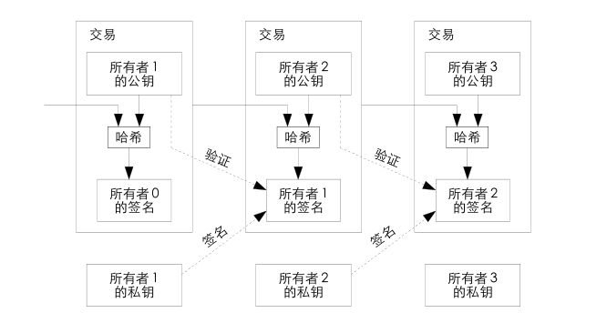

## Electronic Cash 电子货币

好的，上一节我们实现了一个能够在区块链中能识别我们的身份并进行数字签名的钱包。这里我们开始向这个钱包里塞点钱。那么，我们的电子货币应该是什么样的呢？这一节我们先不推进我们的代码，让我们好好构思一下如何实现一个电子货币体系。

---

### 货币是什么样的

我们的货币是什么样的？我们每天都在花钱，但是你花钱的时候有留意过你花的钱是什么样的吗。

今天我们大部分人都使用微信或者支付宝这样的电子支付，当你在手机上输入支付密码(现在花钱越来越方便了，你或许只需要刷一下你的脸甚至是你的掌纹，就可以把钱花掉)，背后的一系列机构公司就将你的账户余额减去一定的数字，然后店家方账户余额增加一定的数字，这样就实现了交易。
你一定也用过现金，你从街上大爷那里拿一根糖葫芦，然后把一张五元的钞票给他，你们就快速实现了一次交易。

这两个交易你都花了钱，但是显然给你的感受是不一样的。首先，我们使用钞票时每一张钞票上都有独一无二的编号，然而线上支付时只有账户上数字的变化，这是最本质的区别。我们在买糖葫芦时，可以直接拿一张5元的纸币给大爷，但是如果我们只有一张10元纸币，那么大爷就需要拿出一张5元找零给我们。但是在线上支付时我们只需要在程序中填一个数字(比如3.14)就可以实现支付。

而对应到我们的加密货币中，这分别代表了我们的两个模型，一个是以比特币为代表的UTXO模型(Unspent Transaction Outputs)，一个是以以太坊为代表的账户模型。

不过这两种模型只不过是实现方式的不同，归根结底无论是现金还是微信支付，最终实现的是一个状态转移，经过这个交易你的钱转移到了店家手里。所以无论是哪个模型，都是一个状态转移系统。

---
### UTXO模型

我们先看看中本聪在比特币白皮书中是怎么描述的:

> We define an electronic coin as a chain of digital signatures. Each owner transfers the coin to the next by digitally signing a hash of the previous transaction and the public key of the next owner and adding these to the end of the coin. A payee can verify the signatures to verify the chain of ownership.

中本聪将一枚电子货币定义为一条数字签名链。每笔交易有输入有输出，而新的交易将之前没有被花费的输出(UTXO)作为输入进行消费，这样将原本属于你的UTXO转移到了店家的地址下。我们看上图中间的那个交易，所有者1(花钱的)将之前的一笔交易和所有者2(收钱的)的公钥(或者地址)进行哈希，然后使用自己的私钥进行签名，这样就组成了一笔交易。然后将这个交易广播到区块链网络中达到共识，就实现了将钱转给所有者2的步骤。

同时我们也会发现，在这个模型下我们的账户余额不是直接储存在区块链里的，我们需要将链上所有的属于我们的UTXO加起来才构成了我们的余额。而我们的支付也不是钱包表现的那么简单，支付时需要在钱包那么多的UTXO中选出能够支付目标的组合，然后将这个组合作为输入。输出也不是只有指向收款方一个那么简单，我们在比特币链上的支付需要向打包的节点支付gas费，如果我们的UTXO组合比较大，还会产生一个输出返回我们的钱包作为找零。

**双花攻击:** 对于这种现金模式的模型有一种攻击方式叫双花攻击。比如现实中我有一张百元大钞，这是一张真钱，于是我将这个钱复制一份，一张拿去吃饭，另一张拿去交学费，这就是双花。现实中我们选择提高复制现金的难度来解决这个问题，使得普通人无法实现复制这一步。但是在数字世界复制是一件再容易不过的事了，如果比特币是一个txt文件，我们可以简单地ctrl+c复制一份，一个拿去买房，一个拿去买车。
比如上面这个图片中，我作为所有者1，可以使用所有者2的公钥和我的上一笔交易产生的UTXO创建转账给所有者2的交易，但同时我也可以使用同样的UTXO和我的另外一个钱包作为接收方创建另外一个交易，同时把两笔交易提交，是不是在实现买东西的同时还没有损失我的钱？

这在比特币中是行不通的，因为其中一笔交易被节点接收后，你原本的UTXO就被花费了，在节点收到另外一个交易时交易的输入已经不是一个合法的UTXO了，那么交易就会失败。

---

### 账户模型

人们谈到以太坊可能以为它只是在比特币的基础上增加了更强大的智能合约，但其实在数字货币的实现上它们也使用了不同的方式。以太坊上使用账户的概念，一个以太坊帐户包含四个字段：

- nonce，用于确保每笔交易只能处理一次的计数器
- 帐户当前的以太币余额
- 帐户的合约代码（若有）
- 帐户的存储（默认为空）

账户分为由私钥控制的外部帐户以及由其合约代码控制的合约帐户，合约的事我们先搁下不表。也就是说一个账户维护一个nonce变量(这个名字取得不好，容易和我们前面区块pow中的随机数混淆)和当前的余额，每当进行一个交易时，nonce变量自增，同时余额进行相应修改。这样的实现在逻辑上仿佛更符合我们对虚拟货币的想象。

**重放攻击:** 对于这种账户模式的转账也有一种攻击叫做重放攻击。想象你现在在便利店买水，你扫码给老板后打算离开，老板说刚刚没扫上，让你再来一次，这样你的钱就被花了两次。而一个人通过以太坊链转账给我，我是否能够将这个交易复制一遍重新广播给区块链，实现扣对面两次钱呢？

答案自然是不行，这正是以为以太坊中维护了一个nonce变量，每次交易后这个变量会加一，而交易时会同时加入当前账户的nonce值进行提交。如果我们重放这个交易，网络会因为这个nonce已经过期而拒绝再次执行这个交易。

---

今天整理了一下我们关于实现电子货币的思路，下一节我们将开始构建一个UTXO模型的电子货币体系，添加到我们的区块链中

**插一嘴:白皮书**
比特币和以太坊的白皮书可以说是入门区块链的必读内容，在它们的官方网站上都可以查看，也有中文翻译版本(虽然存在一些错误)。同时它们的技术文档也是很好的阅读材料。