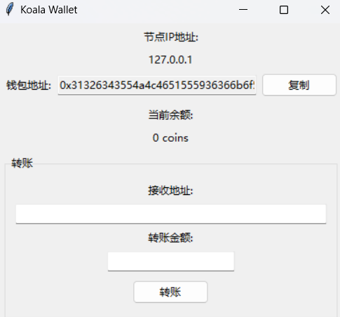

## Transaction

我们上一节对我们的数字货币的实现方式进行了梳理，这里我们开始构建一个UTXO模型的电子货币体系，并把它加入我们的区块链网络中。

上一节我们说到，UTXO模型中所有的交易都至少有一个UTXO输入和一个UTXO输出，并且输入和输出的金额应该是一致的。就和我们使用现金消费一样，你拿出一叠总金额大于商品价格的现金组合给老板，老板将钱收下后计算多余的金额然后进行找零。原来你们两个一起共有一百块，交易后还是一百块。那么，钱一开始从哪里来呢？

在现实中，我们的人民币是从印钞厂印制出来，然后通过银行发行到全国。而在我们的区块链中则大不相同。回想我们POW那一节，我们说到对于拿到记账权的节点会将区块的第一笔交易设置为一个特殊交易，凭空产生一定的货币转到自己的地址中。这是比特币采用的方法，这个"一定的货币"的量随时间递减，称为比特币的**减半**，所有比特币的总量是一定的，为2100万枚。而以太坊的发行量是动态的，是由协议规则、社区共识、EIP提案以及网络经济模型共同决定的。机制比较复杂，这里先按下不表。

---

### 交易和UTXO

下面我们开始实现Transaction和UTXO的实现

对于一个UTXO，我们需要记录的有：
- 产生这个UTXO的交易哈希值 : 比特币白皮书中说"我们将一枚电子货币定义为一条数字签名链"，我们便是通过这个给UTXO一路过来经历的交易将这些签名串到一起。而我们记录了交易的哈希值就可以找到这个交易，这个原理在本节最后再说
- 这个UTXO在交易输出中的索引 : 交易可以有多个输出，所以我们需要记录它的索引才可以找到它
- UTXO的金额 : 这个不用解释了
- 接收者的地址 : 也就是目前这个UTXO拥有者的地址

```py
class UTXO:
    def __init__(self, tx_hash, output_index, amount, recipient_address):
        self.tx_hash = tx_hash  # 交易的哈希
        self.output_index = output_index  # 输出在交易中的索引
        self.amount = amount  # 金额
        self.recipient_address = recipient_address  # 接收者(拥有者)的地址
```

而对于一个交易，我们需要记录的是:
- 交易的输入与输出 : 两个列表，储存输入和输出的UTXO
- 交易的哈希 : 这个交易的哈希值，用来唯一识别这个交易
- 交易签名 : 交易发起者(付钱的)对这个交易哈希的签名
- 发送者的公钥 : 用于验证这个签名

```py
class Transaction:
    def __init__(self):
        self.inputs = []  # 交易输入
        self.outputs = []  # 交易输出
        self.tx_hash = None  # 交易哈希
        self.signature = None  # 交易签名
        self.sender_public_key = None  # 发送者的公钥
```

具体的一些函数实现就不放在这里了，可以在github仓库找到

### 使我们的Wallet类可以适配交易

我们主要需要添加两个方法:创建一个交易(付钱)，接收到一个交易后更新余额(收钱)

要注意:收钱不需要收款方的操作，当付款人提交交易到链上达到共识后，这笔钱已经在你的地址上了。我们这里是要实现在钱包这边更新一下显示的余额，而不是实现收款。

我们的`create_transaction`方法首先选择足够的UTXO添加进交易，如果钱不够就报错退出(没钱就是没钱，再怎么算都付不了钱)。然后在交易中添加需要转账的部分，之后计算找零，添加到输出中。最后计算哈希值并签名，更新自己的utxo池

而`receive_transaction`方法便是先验证一次交易的签名，然后遍历所有的输出，将输出到自己地址下的UTXO记录下来。

```py
class Wallet:
    def __init__(self):
        self.private_key = random.randbytes(32)  # 256位私钥
        self.public_key = generate_public_key(self.private_key)
        self.address = generate_btc_address(self.public_key)
        self.utxo_pool = []  # 钱包中的UTXO集合
    # ...省略其他代码 (i_i)

    def create_transaction(self, recipient_address, amount):
        # 1. 选择足够的UTXO
        selected_utxos = []
        total_amount = 0
        for utxo in self.utxo_pool:
            selected_utxos.append(utxo)
            total_amount += utxo.amount
            if total_amount >= amount:
                break

        if total_amount < amount:
            raise ValueError("Don't have enough coins")

        # 2. 创建交易
        tx = Transaction()
        for utxo in selected_utxos:
            tx.add_input(utxo)

        # 3. 创建交易输出
        tx.add_output(amount, recipient_address)

        # 4. 找零
        change = total_amount - amount
        if change > 0:
            tx.add_output(change, self.address)

        # 5. 计算交易哈希
        tx.calculate_hash()

        # 6. 签名交易
        tx.sign(self.private_key)

        # 7. 更新UTXO池
        self.utxo_pool = [utxo for utxo in self.utxo_pool if utxo not in selected_utxos]

        return tx

    def receive_transaction(self, transaction: Transaction):
        # 1. 验证交易签名
        if not transaction.verify_signature():
            raise ValueError("Invalid transaction signature")

        # 2. 更新UTXO池
        for output in transaction.outputs:
            if output.recipient_address == self.address:
                new_utxo = UTXO(transaction.tx_hash, transaction.outputs.index(output), output.amount, output.recipient_address)
                self.utxo_pool.append(new_utxo)

```

### 修改我们的节点
接下来我们要修改我们的节点类。我们现在可以通过wallet类来创建交易以及接收交易修改自己的余额显示，但是交易的进行需要在节点打包区块时实现。节点在p2p网络中收集各个用户发出的交易，然后对交易在本地进行检查合法性，对合法的交易进行打包。然后进行挖矿，就是我们前面pow一节提过的内容了。要注意的是，我们钱包中检查交易只验证了交易的签名，但是我们节点中不仅要检查签名，还需要检查这个操作是否合法，交易花的UTXO是否存在，有没有出现双花的情况等等。

我们还需要修改挖矿方法，每个区块的第一笔交易应该是一个没有输入只有一个输出给节点自己钱包地址的交易作为挖矿奖励，这里我们将奖励设置为50。简单起见，我们也不实现比特币的减半操作，以及交易gas费了。

我们首先修改Node的变量，添加了交易池和UTXO池，前者储存收集到需要打包的交易，后者储存整个区块链中的UTXO。注意到utxo池使用的是一个哈希表(字典)结构，它的key是交易哈希以及UTXO在交易输出中的索引。我们提到可以使用tx_hash唯一确定交易，而输出索引也是独一无二的，因此可以使用这个作为key来定位UTXO。

```py
class Node:
    def __init__(self, ip):
        # ...省略和这里无关的代码
        self.wallet = Wallet()
        self.mempool = []  # 交易池
        self.mempool_lock = threading.Lock()  # 交易池的锁
        self.global_utxo_pool = {}  # 全局UTXO池，格式: {tx_hash:output_index: UTXO}
        self.utxo_pool_lock = threading.Lock()  # 全局UTXO池的锁
```

接着，我们创建一个检验这个区块中所有交易的函数，这里并不实现交易而是单纯的检验。如果是第一笔交易，检查金额是否为约定的50后便通过。
对于其他交易，首先验证签名，然后验证输入的UTXO是否存在合法，最后验证金额是否正确。最后函数返回这些交易是否合法，以及不合法的交易列表。

```py
    def verify_block_transactions(self, block):
        """验证区块中的所有交易，返回(是否全部有效, 无效交易列表)"""
        transactions = []
        invalid_transactions = []
        
        for leaf in block.merkle_tree.leaves:
            try:
                tx = Transaction.from_json(json.loads(leaf.data))
                transactions.append(tx)
            except:
                continue  # 跳过非交易数据

        # 临时存储已使用的UTXO
        used_utxos = set()

        with self.utxo_pool_lock:
            for tx in transactions:
                # 如果是挖矿奖励交易（第一个交易），直接验证通过
                if transactions.index(tx) == 0:
                    if tx.outputs[0].amount != 50:
                        print(f"Invalid mining reward transaction: {tx.tx_hash}")
                        invalid_transactions.append(tx)
                    continue

                try:
                    # 1. 验证交易签名
                    if not tx.verify_signature():
                        print(f"Invalid transaction signature: {tx.tx_hash}")
                        invalid_transactions.append(tx)
                        continue

                    # 2. 验证输入UTXO
                    total_input = 0
                    valid_inputs = True
                    
                    for utxo in tx.inputs:
                        # 检查UTXO是否已被使用（防止双重支付）
                        utxo_key = f"{utxo.tx_hash}:{utxo.output_index}"
                        if utxo_key in used_utxos:
                            print(f"Double spending detected: {utxo_key}")
                            valid_inputs = False
                            break

                        # 在全局UTXO池中查找这个UTXO
                        if utxo_key in self.global_utxo_pool:
                            total_input += self.global_utxo_pool[utxo_key].amount
                            used_utxos.add(utxo_key)
                        else:
                            print(f"UTXO not found in global pool: {utxo_key}")
                            valid_inputs = False
                            break

                    if not valid_inputs:
                        invalid_transactions.append(tx)
                        continue

                    # 3. 验证输入输出金额
                    total_output = sum(output.amount for output in tx.outputs)
                    if total_input != total_output:
                        print(f"Input/output amount mismatch: {tx.tx_hash}")
                        invalid_transactions.append(tx)
                        continue

                except Exception as e:
                    print(f"Error verifying transaction {tx.tx_hash}: {e}")
                    invalid_transactions.append(tx)
                    continue

        return len(invalid_transactions) == 0, invalid_transactions
```

继续我们实现了一个执行交易的函数，它会修改本地的UTXO池等状态变量

```py

    def process_block_transactions(self, block):
        """处理区块中的所有交易，更新UTXO池"""
        transactions = []
        for leaf in block.merkle_tree.leaves:
            try:
                # 解析JSON字符串
                tx_data = json.loads(leaf.data)
                tx = Transaction.from_json(tx_data)
                transactions.append(tx)
            except Exception as e:
                continue

        with self.utxo_pool_lock:
            for tx in transactions:
                # 如果是挖矿奖励交易（第一个交易），直接添加输出到UTXO池
                if transactions.index(tx) == 0:
                    for i, output in enumerate(tx.outputs):
                        utxo_key = f"{tx.tx_hash}:{i}"
                        self.global_utxo_pool[utxo_key] = output
                        if output.recipient_address == self.wallet.address:
                            self.wallet.add_utxo(output)
                    continue

                # 对于普通交易，直接更新UTXO池
                # 1. 移除已使用的UTXO
                for utxo in tx.inputs:
                    utxo_key = f"{utxo.tx_hash}:{utxo.output_index}"
                    self.global_utxo_pool.pop(utxo_key, None)

                # 2. 添加新的UTXO
                for i, output in enumerate(tx.outputs):
                    utxo_key = f"{tx.tx_hash}:{i}"
                    self.global_utxo_pool[utxo_key] = output
                    # 如果是发给自己的，也添加到钱包的UTXO池
                    if output.recipient_address == self.wallet.address:
                        self.wallet.add_utxo(output)

```


然后我们修改挖矿线程，原理和之前POW中谈到的一样，但是将第一个数据修改为了挖矿激励交易。在进行打包前，我们先对交易池中的所有交易进行检查，删去非法的交易后再使用合法的交易构建Merkle树，继续进行挖矿操作。

```py

    def mine_thread(self):
        while True:
            with self.data_lock:
                # 创建挖矿奖励交易
                mining_reward = Transaction()
                reward_output = UTXO(
                    tx_hash=None,
                    output_index=0,
                    amount=50,
                    recipient_address=self.wallet.address
                )
                mining_reward.outputs.append(reward_output)
                mining_reward.tx_hash = mining_reward.calculate_hash()
                
                # 从交易池中选择交易
                selected_transactions = []
                with self.mempool_lock:
                    selected_transactions = self.mempool
                
                # 将挖矿奖励交易放在第一位
                all_transactions = [mining_reward] + selected_transactions
                    
                # 创建merkle树（注意这里需要先将交易转换为JSON字符串）
                merkle_tree = MerkleTree([json.dumps(tx.to_json()) for tx in all_transactions])

            # 创建区块并验证交易
            block = Block(self.blockchain.height, merkle_tree, 
                         self.blockchain.get_latest_block().hash, 
                         0, time.time(), self.address)
            
            # 验证交易并获取无效交易列表
            is_valid, invalid_txs = self.verify_block_transactions(block)
            
            # 如果有无效交易，从交易池和选中的交易中移除它们
            if invalid_txs:
                with self.mempool_lock:
                    self.mempool = [tx for tx in self.mempool if tx not in invalid_txs]
                    selected_transactions = [tx for tx in selected_transactions if tx not in invalid_txs]
                
                # 重新创建merkle树（包含奖励交易和有效交易）
                all_transactions = [mining_reward] + selected_transactions
                merkle_tree = MerkleTree([json.dumps(tx.to_json()) for tx in all_transactions])
                block = Block(self.blockchain.height, merkle_tree, 
                            self.blockchain.get_latest_block().hash, 
                            0, time.time(), self.address)

            # 尝试挖矿
            nonce = 0
            while not self.getBlock:
                block.nonce = nonce
                block.hash = block.calculate_hash()
                if self.blockchain.is_block_valid(block):
                    with self.blockchain_lock:
                        self.send_block(block)
                        self.blockchain.append_block(block)
                        # 处理新区块中的交易
                        self.process_block_transactions(block)
                        # 从交易池中移除已确认的交易
                        with self.mempool_lock:
                            self.mempool = [tx for tx in self.mempool 
                                          if tx not in selected_transactions]
                    print(f"Mined block {block.index} :{block.hash}")
                    break
                nonce += 1

            with self.signal_lock:
                self.getBlock = False

```

这里便将交易功能加入我们的区块链了，我们会在后面使用这个区块链进行测试。需要一提的是，我们在接收其他节点传来的区块链时，也需要检查区块链中所有交易是否合法，如果存在非法交易则拒绝接收这个区块链，而如果该区块链合法，则需要遍历一遍区块链建立UTXO池。

---

### 建立一个图形化界面

我们接下来使用tkinter建立一个简单的图形化界面(这个库python自带，不需要pip)，界面如下



在初始化绑定ip地址之后(实际中应该是绑定自己主机的公网ip，但是这里在本地演示我们使用本地的回环地址)，程序开始运行节点，并跟踪显示余额。可以通过输入接收者的钱包地址和转账金额实现转账。

如果你在本地运行几个节点，你可能会发现某个钱包一开始挖到了一个区块获得了50个coin的奖励，但是过了一会这50个coin的奖励不见了。这便是区块链**分叉**之后又重新形成了共识。我们的区块链网络中，每个全节点都在努力地挖矿，如果挖到一个区块就添加到本地的区块链后广播给其他节点。但是由于网络延迟(或者故意为之)，这个网络中可能维护了两条区块链。在我们这个例子中，这个节点就是维护了一个和其他一部分节点不同的区块链，在进行通信后发现本地的区块链长度比另外一条链更短，于是更新接收这条长链，重新达到共识，这奖励的50coin也就消失了。

代码没什么实在的东西，可以到github仓库获取。

---

这里回头来填前面的坑

**为什么我们记录了交易的索引就可以找到交易?**
在回答这个问题之前，我再问一个问题**我们的区块链是如何储存的?**
区块链既然是个链，那么很多人可能就会觉得应该顺序储存就行了，我们前面的实现也全部是在内存中使用一个列表记录，没有储存到磁盘中。但是实际上比特币的储存使用的leveldb是一个key-value的数据库(你可以理解为一个哈希表或者字典)，每个区块的key是该区块的哈希值。也就是说我们获取一个区块的哈希值就可以找到这个区块的数据，通过从最新的区块出发，访问它的previous_hash位置就可以获取上一个区块，这样一直向后查找就可以实现区块链的遍历。而我们的交易也存在哈希值，所以交易的储存也使用了同样的方式。

如果你知道哈希表，那你可能会问：这样不会发生哈希碰撞吗？你或许听过: "一个屋子里只要超过23个人，那么就有50%的可能性有两个人同一天出生" ，这个数学结论(生日攻击)在这里就不适用了吗？

这就要谈到SHA256的抗碰撞性了，下面我们简单算笔账:

首先我们看一下生日攻击，如果取值范围为N，需要取k个值，那么没有碰撞的概率为 $ P_{没有碰撞}=\frac{N(N-1)...(N-k+1)}{N^k} $ 那么发生碰撞的概率就是 

$ P_{碰撞} = 1-\frac{N(N-1)...(N-k+1)}{N^k} = 1- \Pi_{i=0}^{k-1}(1-\frac{i}{N})$

当x较小时$ ln(1-x) \approx -x $

计算$ ln(\Pi_{i=0}^{k-1}(1-\frac{i}{N})) =  \sum_{i=0}^{k-1}ln(1-\frac{i}{N}) \approx - \frac{\sum_{i=0}^{k-1} i}{N} = -\frac{k(k-1)}{2N}$

所以去掉对数放回概率中，$P_{碰撞}=1-e^{-\frac{k(k-1)}{2N}}$


我们的tx_id是一个256位的哈希值，那么它一共有 $ 2^{256} $ 个可能值，计算得到大约需要 $ 2^{128} $ 这个数量级碰撞概率才会达到50%，而比特币网络运行到现在只产生了约1,130,074,839笔交易(数据来自https://btc.tokenview.io/cn)，这个数字只是 $ 2^{30} $ 数量级，带入刚刚的公式，碰撞的概率是$ P_{碰撞}= 1-e^{-\frac{1}{2^{197}}} \approx 5 \times 10^{-60} $ 这绝对是一个小概率事件，在找到攻破SHA256算法的方法之前，这就像是在宇宙中两次随机捡起同一粒沙子。


---

目前为止，我们已经实现了一个初具雏形的区块链了！这个专栏的主要内容告一段落，在后面可能会基于这个区块链添加一些复杂一点的功能(比如SPV，gas费之类的)，或者会更新一些区块链其他方面的内容。